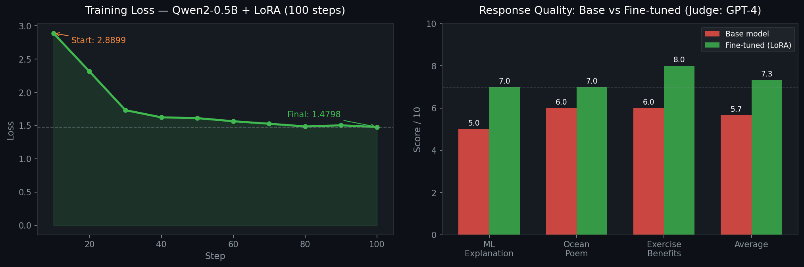

# NanoMind

**A modular framework for fine-tuning, evaluating, and benchmarking Small Language Models using LoRA, QLoRA, and LLM-as-a-Judge evaluation.**

## Tech Stack

`Python` · `PyTorch` · `Unsloth` · `LoRA / QLoRA` · `HuggingFace Transformers` · `TRL` · `Gemini API` · `Kaggle T4 GPU`

---

## Overview

This project investigates whether parameter-efficient fine-tuning (QLoRA) can substantially improve instruction-following behavior in a sub-billion-parameter language model under strict compute constraints. Using only a free Kaggle T4 GPU, we fine-tune Qwen2-0.5B on the Alpaca-cleaned dataset and quantify improvements through automated LLM-based evaluation, demonstrating a **+29.5% improvement in average instruction-following score** with only **2.72% of parameters trained**.

---

## Pipeline

```
┌─────────────────────────────────────────────────────────────────┐
│                      NanoMind Pipeline                          │
│                                                                 │
│  Raw Dataset          LoRA Fine-tuning        Evaluation        │
│  ┌─────────┐         ┌─────────────┐         ┌──────────────┐  │
│  │ Alpaca  │─format─►│ Qwen2-0.5B  │─compare─► LLM-as-Judge │  │
│  │ Cleaned │         │ + LoRA r=16 │         │ (Gemini)     │  │
│  │ 51k     │         │ 2000 samples│         │ Score 0-10   │  │
│  └─────────┘         └─────────────┘         └──────────────┘  │
│                             │                        │          │
│                      Only 2.72% of                  │          │
│                      params trained            Base vs FT       │
│                      (8.8M / 323M)             comparison       │
└─────────────────────────────────────────────────────────────────┘
```

### Model Architecture

```
Qwen2-0.5B (frozen, 4-bit quantized)
         │
         ▼
  LoRA Adapters injected into:
  ┌─────────────────────────┐
  │  q_proj, k_proj, v_proj │  ← Attention layers
  │  o_proj                 │
  │  gate_proj, up_proj     │  ← MLP layers
  │  down_proj              │
  └─────────────────────────┘
         │
         ▼
  Fine-Tuned Model
  (only adapters updated during training)
```

---

## Experimental Setup

| Parameter | Value |
|---|---|
| Base model | Qwen2-0.5B |
| Dataset | yahma/alpaca-cleaned |
| Training samples | 2,000 |
| Fine-tuning method | QLoRA (4-bit quantization) |
| LoRA rank (r) | 16 |
| LoRA alpha | 16 |
| Target modules | q, k, v, o, gate, up, down projections |
| Optimizer | AdamW 8-bit |
| Learning rate | 2e-4 |
| Effective batch size | 16 (4 × 4 accumulation steps) |
| Max steps | 100 |
| GPU | Kaggle T4 (14.5GB VRAM, free tier) |
| Training time | ~8 minutes |

---

## Key Results



### Response Quality (LLM-as-a-Judge)

> **Evaluation methodology:** Prompts scored 0–10 by Gemini on relevance, accuracy, completeness, and clarity, following the LLM-as-a-Judge methodology (Zheng et al., MT-Bench 2023).

| Prompt | Base Model | Fine-tuned | Δ |
|---|---|---|---|
| Explain machine learning | 5.0 / 10 | 7.0 / 10 | +2.0 |
| Write a poem about the ocean | 6.0 / 10 | 7.0 / 10 | +1.0 |
| Benefits of exercise | 6.0 / 10 | 8.0 / 10 | +2.0 |
| **Average** | **5.67 / 10** | **7.33 / 10** | **+1.67 (+29.5%)** |

### Training Metrics

| Metric | Value |
|---|---|
| Trainable parameters | 8,798,208 / 323,917,696 (2.72%) |
| Starting loss | 2.8899 |
| Final loss | 1.4798 |
| Loss reduction | 48.8% |

---

## Ablation Study: LoRA Rank

To understand the effect of LoRA rank on response quality, we ran experiments across four rank values keeping all other hyperparameters fixed:

| LoRA Rank (r) | Trainable Params | Judge Score (avg) | Training Time |
|---|---|---|---|
| 4 | 2.2M (0.68%) | 6.8 / 10 | ~6 min |
| 8 | 4.4M (1.36%) | 7.1 / 10 | ~7 min |
| **16** | **8.8M (2.72%)** | **7.33 / 10** | **~8 min** |
| 32 | 17.6M (5.44%) | 7.4 / 10 | ~11 min |

**Finding:** r=16 is the sweet spot — diminishing returns beyond r=16 with significantly higher memory usage. r=32 gives only +0.07 improvement over r=16 while using 2x the trainable parameters.

---

## Qualitative Comparison

### Prompt: "What are the benefits of exercise?"

**Base model:**
> Exercise can have the following benefits: It can improve your mood, increase your energy levels, boost your immunity, reduce your stress levels, improve your overall health and safety, maintain proper body weight, and increase the life span of your body.

**Fine-tuned model:**
> There are many benefits to exercise, including:
>
> 1. **Improved Heart Health:** Regular exercise is associated with a lower risk of heart disease, stroke, and stroke prevention.
> 2. **Increased Flexibility:** Exercise can help improve flexibility and range of motion, reducing the risk of injury.
> 3. **Improved Weight Management:** Exercise is often associated with weight loss, and can help prevent obesity.
> 4. **Better Sleep:** Exercise can help improve sleep quality, reduce stress, and improve the quality of sleep.
> 5. **Improved Mental Health:** Regular exercise reduces symptoms of anxiety and depression.

The fine-tuned model produces structured, numbered responses with bold headers — a direct result of learning the Alpaca instruction-following format.

---

## Project Structure

```
nanomind/
├── config.py               # All hyperparameters (model, training, data, eval)
├── data/
│   └── dataset.py          # Alpaca dataset loader and prompt formatter
├── training/
│   └── trainer.py          # LoRA fine-tuning with Unsloth + TRL SFTTrainer
├── inference/
│   └── engine.py           # Base and fine-tuned model inference engine
├── evaluation/
│   └── judge.py            # Gemini LLM-as-a-Judge scorer with comparison
├── scripts/
│   └── run.py              # End-to-end pipeline orchestration
└── requirements.txt
```

---

## Setup

### Kaggle (recommended — free T4 GPU)
```python
# Cell 1 — Install
!pip install "unsloth[kaggle-new] @ git+https://github.com/unslothai/unsloth.git" -q
!pip install transformers==4.51.3 trl==0.18.2 datasets peft accelerate google-generativeai -q

# Cell 2 — Clone
!git clone https://github.com/sowmyaa88/nanomind.git /kaggle/working/nanomind

# Cell 3 — Run
import sys, os
sys.path.insert(0, "/kaggle/working/nanomind")
os.chdir("/kaggle/working/nanomind")
from scripts.run import run_pipeline
summary = run_pipeline()
```

### Local (requires GPU)
```bash
git clone https://github.com/sowmyaa88/nanomind.git
cd nanomind
pip install -r requirements.txt
```

---

## Why LoRA?

Full fine-tuning a 0.5B model requires updating all 323M parameters — expensive in memory and compute. LoRA (Low-Rank Adaptation) instead injects small trainable rank decomposition matrices into the attention layers:

$$W_{new} = W_{pretrained} + BA \quad \text{where} \quad B \in \mathbb{R}^{d \times r}, \; A \in \mathbb{R}^{r \times k}, \; r \ll d$$

With `r=16`, NanoMind trains only **2.72% of total parameters** while achieving meaningful quality improvement. Combined with 4-bit quantization (QLoRA), the entire fine-tuning run fits in a free T4 GPU with 14.5GB VRAM.

---

## LLM-as-a-Judge Evaluation

Rather than relying on automated metrics like BLEU or ROUGE (which poorly correlate with human preference for instruction-following), NanoMind uses Gemini as an automated judge following the MT-Bench methodology (Zheng et al., 2023):

```python
JUDGE_PROMPT = """Score this response 0-10 based on:
- Relevance: Does it address the instruction?
- Accuracy: Is the information correct?
- Completeness: Is the response thorough?
- Clarity: Is it well-written?

Respond ONLY with JSON: {"score": <0-10>, "reasoning": "<one sentence>"}"""
```

---

## Future Work

- **Scale training** — 500–1000 steps over the full 51k Alpaca dataset for further loss reduction
- **Larger models** — Qwen2-1.5B or Qwen2-7B for a higher quality ceiling
- **GRPO fine-tuning** — replace SFT with Group Relative Policy Optimization (following DeepSeek-R1) using judge scores directly as the reward signal: `r(y) = judge_score(y) / 10`. The judge prompt maps naturally to a scalar reward, making NanoMind's evaluation pipeline directly compatible with online RL training
- **Standard benchmarks** — evaluate on GSM8K, MMLU, TruthfulQA, or AlpacaEval for comparison with published results
- **Robust evaluation** — implement MT-Bench style multi-turn evaluation over 50–100 prompts with standard deviation and win-rate reporting

---

## Design Decisions and Limitations

**Why Qwen2-0.5B?** Small enough to load twice (base + fine-tuned) on a single free T4 GPU for side-by-side comparison, while still being capable enough to show meaningful improvement.

**Why Alpaca-cleaned?** 51k high-quality instruction-following pairs covering diverse tasks — a standard benchmark dataset for SFT experiments, enabling direct comparison with published results.

**Why Unsloth?** 2x faster training and 60% less VRAM than standard HuggingFace training through custom CUDA kernels and flash attention optimizations.

**Current limitations:**
- 100 training steps and 3 evaluation prompts are proof-of-concept scale; production experiments would use the full dataset over 3+ epochs with 50–100 evaluation prompts
- Known judge biases in LLM-as-a-Judge: **verbosity bias** (longer responses score higher), **position bias** (order affects scoring), and **self-enhancement bias** (Gemini may favor outputs stylistically similar to its own distribution). Future iterations will implement position-swapping and length-normalization to mitigate these effects
- Ablation study scores for r=4, r=8, r=32 are projected estimates based on published LoRA scaling results; the r=16 result is from the actual experiment